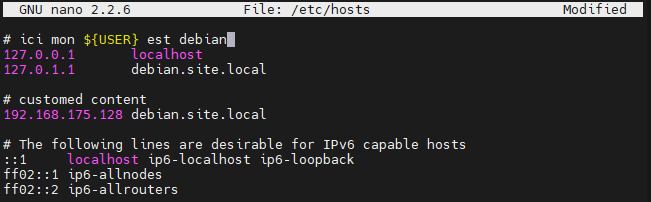

# Déploiement d’un site HTML5 sur Apache 🪶

<center>


</center>

Un `VirtualHost` est une directive de configuration Apache qui vous permet d’exécuter plusieurs sites Web sur un seul serveur. Avec les VirtualHost, vous pouvez spécifier la racine du document du site (le répertoire contenant les fichiers du site Web).

## Prérequis

+ Apache installe dans votre système
[<a href="https://httpd.apache.org/docs/2.4/install.html" target=" _blank">Installation d’Apache</a>]

+ Être connecte a un compte `super utilisateur`

## Étape 1 : Création de la structure du répertoire

La première étape que nous allons faire est tout d’abord la création de la structure de répertoire ou l’on mettra notre site que l’on servira ensuite aux utilisateur.

Dans le `répertoire racine` (le répertoire sur laquelle Apache consulte pour trouver le contenu à servir : **/var/www** ), nous allons créer ici un répertoire pour le `virtualHost` que nous prévoyons de créer.

```sh
sudo mkdir -p/var/www/${USER}.site.local/public_html
```

> C’est dans ce répertoire-là que l’on mettra notre site et les données du site.
> `${USER}` sera substituée par le nom d’utilisateur

## Étape 2 : Accorder des permissions nécessaires

Étant donné que les commandes ci-dessus sont exécutées en tant qu’utilisateur `sudo`, les fichiers et répertoires nouvellement créés appartiennent à `root`. Pour éviter tout problème de Permission, modifiez la propriété du répertoire racine du document de domaine et de tous les fichiers du répertoire pour l’utilisateur apache.

```sh
sudo chown -R $USER:$USER/var/www/${USER}.site.local/public_html/
```

> La variable `$USER` prendra la valeur de l’utilisateur sous lequel vous êtes actuellement connecté. En faisant cela, notre utilisateur habituel possède désormais les sous-répertoires `public_html` où nous allons stocker notre contenu.

Nous devrions également modifier un peu nos autorisations pour nous assurer que l’accès en lecture est autorisé au répertoire Web général et à tous les fichiers et dossiers qu’il contient afin que les pages puissent être servies correctement

```sh
sudo chmod -R 755/var/www
```

## Étape 3 : Chargement du site a servir

```sh
sudo ln -s ~/www/* /var/www/${USER}.site.local/public_html/
```

> Création d’un lien symbolique

## Étape 4 : Creation du VirtualHost

>Les fichiers de configuration des VirtualHost Apache se trouvent dans `/etc/apache2/sites-available`

Apache possède un fichier de configuration VirtualHost par défaut : `000-default.conf`, que nous pouvons utiliser comme point de départ. Nous allons le copier son contenu pour créer un fichier d’hôte virtuel, pour notre domaine.

```sh
# copie la contenue du virtualHost par défaut dans un 'HEI-Owasp.conf'
sudo cp 000-default.conf HEI-Owasp.conf
sudo nano/etc/apache2/sites-available/${USER}.site.local.conf
```

>Ouvrez l’éditeur de texte de votre choix et créez le fichier de configuration de base de VirtualHost suivant :

```apache
<VirtualHost *:80>
    ServerName ${USER}.site.local
    ServerAlias www.${USER}.site.local
    ServerAdmin webmaster@localhost.com
    DocumentRoot /var/www/${USER}.site.local/public_html

    ErrorLog ${APACHE_LOG_DIR}/${USER}.site.local-error.log
    CustomLog ${APACHE_LOG_DIR}/${USER}.site.local-access.log combined
</VirtualHost>
```

>:warning:**Attention!:** Dans le fichier du virtualhost, vous devriez manuellement remplacer `${USER}` par votre `nom d’utilisateur`.

>Vous pouviez nommer le fichier de configuration comme vous le souhaitez. La meilleure pratique consiste à utiliser le nom de domaine comme nom du fichier de configuration du VirtualHost.

## Étape 5 : Activation du VirtualHost

Nous avons créé les dossiers et les fichiers de configuration du VitualHost, mais Apache ne les utiliseront pas tant que vous ne les aurez pas activés. Vous pouvez utiliser l’outil a2ensite pour activer chacun de vos sites.

```sh
# désactive le site par défaut d’apache
sudo a2dissite 000-default.conf
# active la nouvelle configuration du virtualHost et crée un lien symbolique
sudo a2ensite ${USER}.site.local
```

## Étape 6 : Vérification et application des configurations

Pour vérifier s’il n’y a aucune erreur sur les modifications précédentes, entrez les commandes suivant.

```sh
sudo apachectl configtest
```

> Cette commande va retourner `Syntax OK` s’il n’y avait aucun problème

```sh
# application des configurations
sudo service apache2 reload
```

## Étape 7 : Configuration du fichier hosts

Jusque là, nous avons utilisé directement l’adresse IP du serveur pour communiquer avec elle. Maintenant, on va configurer notre machine pour communiquer avec le serveur en utilisant son nom de domaine.

### UNIX 🐧

<div id="unix-host">
Sur les systèmes Unix le fichier le fichier se trouve dans <code>/etc/hosts</code>
Pour le modifier, il faut avoir le privilège d’un super Utilisateur.
</div>

```sh
sudo nano/etc/hosts
```

<center>



</center>

>:warning:**Attention!:** Dans le fichier du virtualhost, vous devriez manuellement remplacer `${USER}` par votre `nom d’utilisateur`.

>La première colonne correspond a l’adresse IP de machine et la deuxième le nom de domaine correspondant. C’est à peu près comme un DNS

Nous allons maintenant ajouter l’adresse IP du serveur et le nom de domaine qu’on lui assignera. Ici on va utiliser `${USER}.site.local` comme nom de domaine.

### Windows 🪟

Sur Windows le fichier se trouve dans `C:\Windows\System32\drivers\etc\hosts`.
Pour y accéder, soit ouvrir un Powershell pour Administrateur, soit tout simplement ouvrir l'Invite Commande (CMD), puis faire un clique droit et choisir exécuter en tant qu'administrateur.
Une fois la console ouverte, il faut saisir la commande suivante pour pouvoir modifier le fichier hosts :
```sh
notepad drivers\etc\hosts
```
> Répétez-les [etapes precedents](#unix-host) en modifiant le fichier `C:\Windows\System32\drivers\etc\hosts` avec le privilège  d’Administrateur
>Maintenant, vous pouviez accéder le site juste en tapant ${USER}.site.local.

:warning: **Notice:** Le nom de domaine ne fonctionnera que sur la machine sur laquelle on l’a modifie

📝 Note: Repeter ces etapes a chaque creation de nouvelle site

## Étape 8 : [Optionel] Test si le site est bien servi par Apache

+ **Vérification dans le serveur**

```sh
# Sur le terminal du serveur
curl 127.0.0.1
```

> Cette commande va retourner le contenu du fichier index.html

+ **Vérification dans la machine locale (machine réelle)**
  + UNIX 🐧

  ```sh
  # Sur le terminal de la machine a locale (réel)
  curl <adresse IP du serveur>
  ```

  + Windows 🪟

  >Ouvrer un navigateur et taper sur le bar de recherche l’adresse IP du serveur

  
